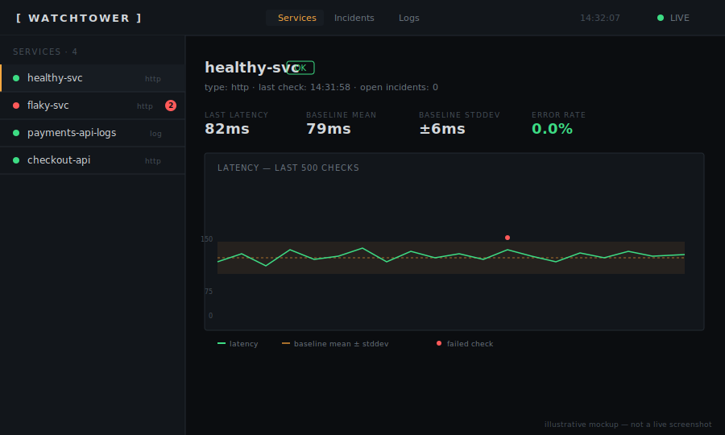

# Watchtower

A self-hosted, local-first monitoring tool that combines HTTP uptime
checking with log intelligence — and does real statistical anomaly
detection instead of simple threshold alerts. Watchtower learns a
per-service baseline (response time distribution, error rate, error-type
diversity) over time and flags genuine anomalies — latency drift, error
rate spikes, or brand-new error signatures it's never seen before —
rather than just telling you a service is up or down.

Built in phases, each with real tests against a live backend, not mocked
end-to-end. See [`docs/architecture.md`](docs/architecture.md) for the
full system design.



*The image above is a hand-built illustrative mockup matching the app's
real color palette and layout, **not a photographed screenshot** — this
was built in a sandboxed environment without a GUI browser available.
Run the quickstart below and you'll see the real thing in a couple of
minutes.*

## What makes this different from Uptime Kuma

Uptime Kuma (and most self-hosted monitors) tell you a service is up or
down against a fixed threshold you set by hand. Watchtower instead:

- Learns an exponential-moving-average baseline per service (latency
  mean/stddev, error rate) and flags statistically significant deviation,
  not just "request failed."
- Tracks distinct error *signatures* (normalized, hashed error messages)
  per service, so it can tell you "this is a brand-new kind of error
  you've never seen from this service" — not just "an error happened."
- Treats structured log ingestion as a first-class citizen alongside HTTP
  checks, with the same anomaly-detection machinery applied to log error
  rates and error types.
- De-duplicates alerts by incident *lifecycle* (opened → ongoing → 
  resolved → escalated), not by re-notifying every check cycle.

## Quickstart

Two things running side by side: the FastAPI backend, and the React
dashboard. Should take under 10 minutes.

**Prerequisites:** Python 3.11+, Node 18+, npm.

### 1. Backend

```bash
cd watchtower

# On Debian/Ubuntu-based systems (including most cloud dev containers),
# a bare `pip install` at this point will fail with
# "error: externally-managed-environment" (PEP 668). Use a virtual env:
python3 -m venv .venv
.venv/bin/pip install -r requirements.txt
.venv/bin/python3 -m uvicorn app.main:app --reload

# Or, if you don't want a venv and know what you're doing:
# pip install -r requirements.txt --break-system-packages
```

If you're on macOS or already inside a venv/conda env, a plain
`pip install -r requirements.txt` is fine.

The sample config points at a couple of placeholder services and a
placeholder Discord webhook — edit `config/config.yaml` to point at
services you actually want to monitor before relying on this for real.

You should see a few startup log lines, including:

```
AUTH IS DISABLED. This instance is unauthenticated -- do not expose it
to the public internet like this. ...
```

That's expected on a fresh config — auth is off by default so the
quickstart isn't gated behind a password. See
[Enabling auth](#auth-http-basic) below before deploying anywhere
reachable outside your own machine.

Confirm it's alive:

```bash
curl http://127.0.0.1:8000/health
# {"status":"ok"}
```

You'll also see a handful of warnings in the startup log — failed checks
against `api.example.com`, a 403 from the placeholder Discord webhook
URL, "log file not found" retries for a `/var/log/...` path that doesn't
exist on your machine. **That's expected** with the sample config as
shipped — a failed check or a missing log file logs a warning and keeps
retrying, it doesn't crash the process. Edit `config/config.yaml` to
point at services you actually run and those warnings go away.

### 2. Frontend

In a second terminal:

```bash
cd watchtower/frontend
npm install
npm run dev
```

Open **http://localhost:5173**. The Vite dev server proxies `/api` and
`/health` through to the backend on port 8000, so there's nothing else
to configure. You should see the service list populate within a few
seconds as the scheduler's first checks land.

### 3. (Optional) point it at something real

Edit `config/config.yaml`, add a real HTTP endpoint under `services:`,
restart the backend. Within `cold_start_min_samples` checks (20 by
default) the detector will have a baseline and start scoring for
anomalies.

## Docker

```bash
docker compose up --build
```

Backend on `:8000`, dashboard on `:8080` (nginx serves the built
frontend and proxies `/api`, `/health`, `/ingest` through to the backend
container — same-origin, no CORS setup needed). `config/` and `data/`
are bind-mounted, not baked into the image, so:

- edit `config/config.yaml` on your host and restart the backend
  container to pick up changes
- `data/watchtower.db` is a real file on your host you can open directly
  with `sqlite3 data/watchtower.db` — not hidden inside Docker's managed
  volume storage

If you use a `type: log, source: file` service, mount whatever host
directory it reads from too — see the commented example in
`docker-compose.yml`.

**For anything internet-facing:** remove the backend's `8000:8000` port
mapping (only the frontend/nginx container needs to be reachable) and
enable [auth](#auth-http-basic).

**A limitation worth being upfront about:** this was built in a sandbox
without a working Docker daemon (the apt mirror available to it doesn't
have the packages needed to install one), so the Dockerfiles and compose
config below are carefully written and validated everywhere they could
be *without* actually running them in a container — YAML/path
consistency checks, and the exact `pip install` / `npm ci && npm run
build` sequences each Dockerfile runs, verified standalone. But `docker
compose up` itself hasn't been run end-to-end. Please do that sanity
check yourself before relying on this, and open an issue if something's
off — the nginx SSE proxy settings in particular (`proxy_buffering off`
etc.) are the part most worth double-checking, since a subtly wrong
reverse-proxy config there would silently break live dashboard updates
rather than fail loudly.

## Configuration reference

See [`config/config.yaml`](config/config.yaml) for a fully-annotated
example covering every option below.

| Key | Meaning |
|---|---|
| `storage.path` | Path to the SQLite file. Created on first run. |
| `auth.enabled` | HTTP Basic auth on `/api/*` and `/ingest/logs/*`. Off by default; `/health` is always open. |
| `auth.username` / `auth.password` | Literal credentials. |
| `auth.password_env` | Alternative to `password` — reads the secret from an environment variable instead of the yaml file. |
| `notifications.<name>.kind` | Currently only `webhook`. |
| `notifications.<name>.url` | Webhook URL (e.g. a Discord webhook). |
| `notifications.<name>.format` | `discord` (real Discord embed shape) or `generic` (plain JSON). |
| `detector.run_interval_seconds` | How often the detector evaluates new data. |
| `detector.ema_alpha` | EMA smoothing factor for baselines (0–1). Lower = baseline adapts more slowly, resists being corrupted by a transient incident; higher = adapts faster to genuine sustained shifts. |
| `detector.cold_start_min_samples` | Minimum observations before a metric is scored for anomalies. Note: for `error_rate`, this counts detector *cycles*, not individual log/check lines. |
| `detector.latency_stddev_threshold` / `error_rate_stddev_threshold` | Z-score threshold for flagging an anomaly. |
| `services[].type` | `http` or `log`. |
| `services[].check.*` | HTTP check config (url, method, interval, timeout, expected status codes) — required for `type: http`. |
| `services[].log.*` | Log source config (`source: file` with a `path`, or `source: push` for the `/ingest/logs` API) — required for `type: log`. |
| `services[].detector` | Per-service overrides of any `detector.*` key above. |
| `services[].notify` | List of notification channel names (must exist under `notifications:`). |

Config is validated at startup with a **single combined error message**
listing every problem found, not one at a time — see
`app/config.py`.

## Auth (HTTP Basic)

```yaml
auth:
  enabled: true
  username: admin
  password_env: WATCHTOWER_PASSWORD   # recommended over a literal password
```

```bash
export WATCHTOWER_PASSWORD=your-real-secret
python3 -m uvicorn app.main:app
```

Your browser will prompt for credentials the first time it hits the
dashboard. `/health` stays open (standard practice for load balancer /
uptime checks and reveals nothing about monitored services).

## Project structure

```
watchtower/
├── app/                  # FastAPI backend
│   ├── main.py             # app assembly, auth wiring, config loaded at import time
│   ├── config.py           # pydantic config models + validation
│   ├── storage.py          # SQLite access (single writer, WAL mode)
│   ├── scheduler.py        # HTTP check scheduling
│   ├── watchers/            # HTTPWatcher, FileLogWatcher
│   ├── parsers.py          # plaintext_regex / json_lines log parsers
│   ├── log_manager.py      # registers log services, starts tailers
│   ├── detector.py         # EMA baselines, anomaly scoring, novel-error tracking
│   ├── detector_loop.py    # periodic detector runner
│   ├── incident_manager.py # incident lifecycle + de-dup
│   ├── notifier.py         # webhook dispatch
│   ├── api.py               # REST endpoints + SSE stream
│   └── auth.py               # HTTP Basic auth dependency
├── frontend/              # React + Vite dashboard
│   ├── Dockerfile           # multi-stage: node build -> nginx serve
│   ├── nginx.conf           # SPA + reverse proxy to backend (SSE-safe)
│   └── src/
│       ├── App.jsx           # nav shell, live event wiring
│       └── components/       # ServiceList, ServiceDetail, IncidentsView, LogsView, LatencyChart
├── schema/001_init.sql     # SQLite schema
├── config/config.yaml      # annotated example config
├── docs/architecture.md    # full system design doc
├── Dockerfile              # backend image
├── docker-compose.yml       # backend + frontend, bind-mounted config/data
└── tests/                  # see Testing below
```

## Testing

**Backend — pytest** (primary suite, 27 tests):

```bash
pip install -r requirements-dev.txt
python3 -m pytest tests/ -v
python3 schema/verify_schema.py
```

Real SQLite (temp file per test), a real embedded HTTP receiver for
webhook tests, and a real `uvicorn.Server` running in a background
thread for the API/SSE tests — not mocked end-to-end. See
`tests/conftest.py` and each `test_*.py` module's docstring for what's
covered.

**Not yet converted to pytest:** `tests/phase1`–`phase2`, `phase5`,
`phase7` remain standalone scripts. They spin up real background
processes (a flaky HTTP server, live scheduler ticks against real
external URLs) in ways that need more restructuring than fit in this
pass to convert safely — rather than half-convert them and risk
something subtly different from what was actually tested, they're
staying as-is for now. Run them directly, e.g.:

```bash
python3 tests/phase4_incident_test.py   # (fully superseded by test_incidents.py now)
python3 tests/phase7_seed_history.py    # seeds data; see its docstring
```

**Frontend:**

```bash
cd frontend
npm test
```

Vitest + React Testing Library + jsdom — real component rendering and
hooks logic, with `fetch`/`EventSource` mocked (no real browser was
available in the sandbox this was built in — see [Known
limitations](#known-limitations)).

## CI

`.github/workflows/ci.yml` runs the pytest suite + schema check, and the
frontend test suite + production build, on every push/PR. **Caveat:**
this was written and locally simulated (exact same commands, clean venv)
in a sandbox without access to real GitHub Actions infrastructure to
actually execute the workflow — the YAML is syntax-validated and every
command in it has been run and passes locally, but the workflow itself
hasn't triggered a real Actions run yet. Push this and check the Actions
tab after your first commit to confirm.

## Known limitations

Collected from testing across every phase — nothing here is hidden, all
of it was found and documented at the point it was discovered:

- **Detector watermarks are in-memory.** A process restart re-scans each
  service's data from the beginning rather than resuming from where it
  left off. Fine at small scale; would need a persisted watermark before
  running against a very large pre-existing table.
- **No first-class link between an HTTP service and a corresponding log
  service.** "View logs around this incident" searches all log sources
  in a time window rather than assuming e.g. `payments-api` and
  `payments-api-logs` are related beyond their names.
- **EMA baselines adapt.** A sustained anomaly gets partially absorbed
  into "the new normal" at whatever rate `ema_alpha` allows — this is a
  real tradeoff, not a bug; tune `ema_alpha` per-service if a specific
  service needs slower/faster adaptation.
- **Error-signature normalization collapses status codes.** `"unexpected
  status 500"` and `"...502"` hash to the same signature (digits are
  stripped during normalization) — deliberate, to avoid over-fragmenting
  on incidental numbers, at the cost of status-code granularity.
- **No webhook retry.** A failed notification delivery is recorded
  (`status='failed'` in the `notifications` table) but not retried.
- **No pagination cursor** on `/api/incidents` or log search — just a
  `limit` cap. Fine at self-hosted scale.
- **Docker Compose setup is un-run end-to-end** — no working Docker
  daemon was available in the sandbox this was built in. Everything
  checkable without a daemon (YAML syntax, path consistency, the exact
  install/build commands each Dockerfile runs) was verified standalone;
  `docker compose up` itself needs a real sanity check before relying on
  it. See the [Docker](#docker) section.

## Contributing

See [`CONTRIBUTING.md`](CONTRIBUTING.md).

## License

Not yet chosen. Add one (MIT is a common default for a project like this)
before anyone else depends on it.
